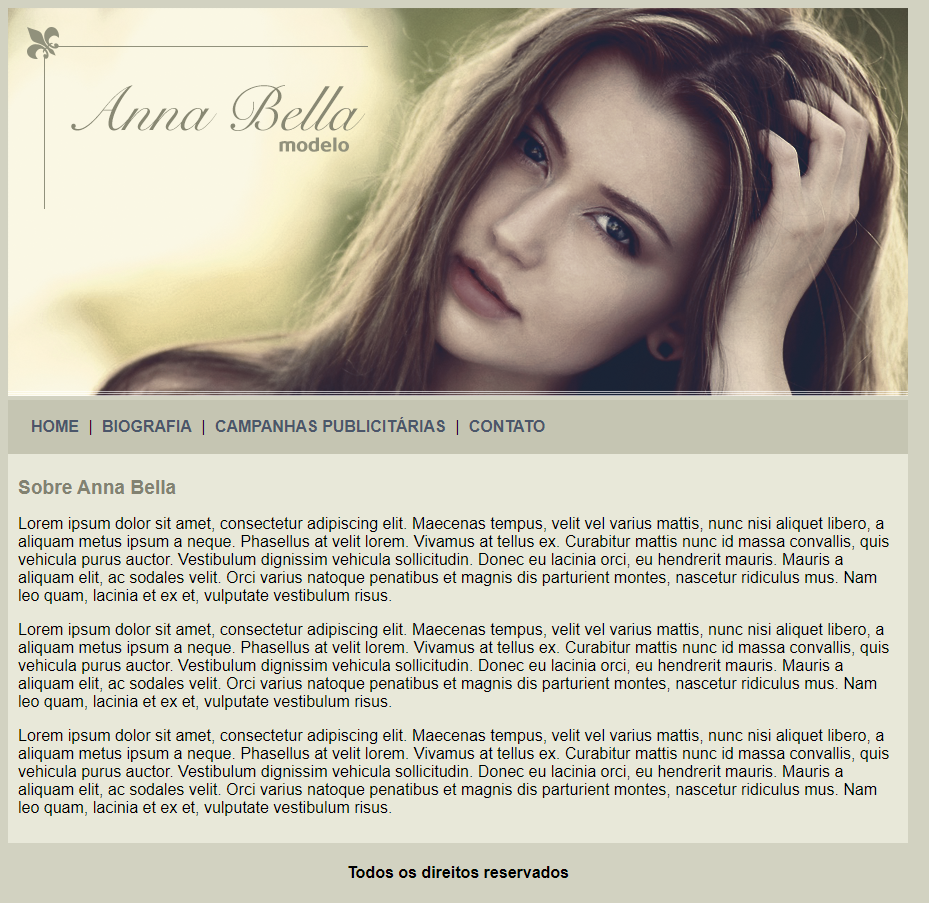

# Anna Bella
> Primeiro projeto acadêmico utilizando CSS3.

Este é o meu primeiro projeto como desenvolvedor web (utilizando CSS3), se trata de um site para uma 
modelo fictícia. 

Projeto desenvolvido no curso de __Desenvolvimento web completo__, abordando os princípios do CSS3. 

## Meta

Paulo Marques - [@prmarquesz](https://twitter.com/prmarquesz) - paulormarques21@gmail.com

Udemy - [Curso de Desenvolvimento Web completo](https://www.udemy.com/course/web-completo/)